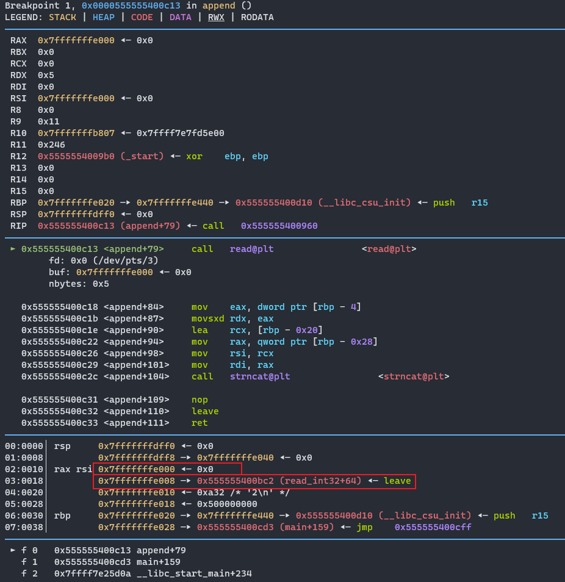
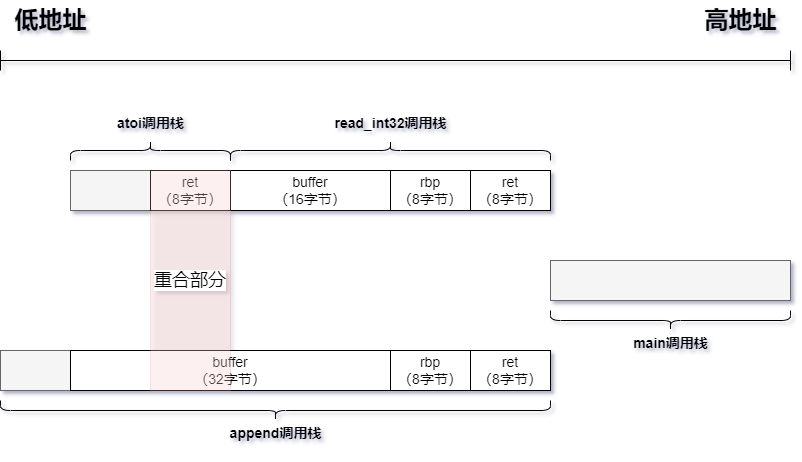

关键代码：

```c
undefined8 main(void)

{
  int iVar1;
  char local_408 [1024];
  
  setup();
  memset(local_408,0,0x400);
LAB_00100c5d:
  do {
    while( true ) {
      while( true ) {
        print_menu();
        iVar1 = read_int32();
        if (iVar1 != 1) break;
        printf("data: ");
        fgets(local_408,0x80,stdin);
      }
      if (1 < iVar1) break;
      if (iVar1 == 0) {
        return 0;
      }
LAB_00100cf2:
      puts("Invalid");
    }
    if (iVar1 != 2) {
      if (iVar1 != 3) goto LAB_00100cf2;
      printf("Your message: %s\n",local_408);          // B
      goto LAB_00100c5d;
    }
    append(local_408);
  } while( true );
}

void read_int32(void)

{
  char local_18 [16];
  
  memset(local_18,0,0x10);
  read(0,local_18,0x10);
  atoi(local_18);
  return;
}

void append(char *param_1)

{
  int iVar1;
  char local_28 [28];
  uint local_c;
  
  iVar1 = rand();
  local_c = (uint)(iVar1 >> 0x1f) >> 0x1c;
  local_c = (iVar1 + local_c & 0xf) - local_c;
  printf("Give me %d chars: ",(ulong)local_c);
  read(0,local_28,(long)(int)local_c);                   // C
  strncat(param_1,local_28,(long)(int)local_c);          // A
  return;
}

void win(void)

{
  system("cat flag");
  return;
}
```


安全参数：

```
[*] '/home/noevil/share/pwn/challenge_35/image/challenge/challenge'
    Arch:     amd64-64-little
    RELRO:    Full RELRO
    Stack:    No canary found
    NX:       NX enabled
    PIE:      PIE enabled
```


思路：

- 很明显的ret2win类型，因为是PIE编译的，得先找到win地址；

- 明显A处有溢出，配合B行获取一些有用的信息；

- 程序中用到的字符串操作函数，如strncat，fgets都会在字符串末尾加上空字符'\0'，所以不能直接溢出打印main的返回地址；

- C行看起来很可疑，没有做初始化，也没有在末尾加空字符，加断点看看：



​	buffer地址为0x7fffffffe000，与它相邻的0x7fffffffe008看起来可以利用。

​	分析下函数的堆栈信息：



main函数在调用append前调用read_int32，因为没有初始化buffer，所有buffer+0x8的位置会有残留的ret地址，既read_int32+64地址，因此可以填充前面8个字节，以满足A行的条件，从而获取基地址。
